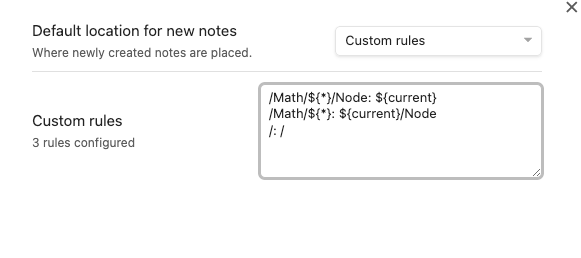

# Default locations for new notes

扩展 Obsidian 原生的设置项，在原有设置功能的基础上增加了2个变量，方便使用


前两个选项与官方设置一致，后两个选项中可以使用变量

- `${root}` 仓库根目录
- `${current}` 当前笔记所在目录

## 示例

### 用法一: root变量
此设置等价于第一个选项(Vault Folder)


### 用法二：current变量
此设置等价于第二个选项(Same folder as current file)


### 用法三：当前目录下的子目录
新笔记将保存在当前目录下的`notes`子目录中


### 用法四：根目录下的子目录
新笔记将保存在仓库根目录下的`notes`子目录中


### 用法五：自定义规则
通过配置 `key:value`的形式来更精细的定义每一个笔记中创建新笔记的保存位置，其中`key`用来匹配笔记文档的路径，可以使用目录通配符`${*}`匹配任意单个目录，`value`中可以使用`${root}`和`${current}`变量来指定新笔记的存放位置。

举个例子：
```text
/a/b/c.md
在这个笔记中所创建的笔记的存放位置，取决于匹配到的规则，匹配顺序如下：
- /a/b/c.md
- /a/b
- /a
- /
```
如果想让`/a`目录下的笔记在创建新笔记时保存到`/a/notes`目录下，则可以添加这样的规则：
```text
/a: ${current}/notes
```
如果想让`/a`和`/b`目录下的笔记创建的新笔记分别保存到对应目录下的二级`notes`子目录，则可以添加这样的规则：
```text
/${*}: ${current}/notes
```




## 使用注意

1. 需要确保配置的目录是存在的，否则将默认存放在仓库根目录。
2. 在禁用该插件之后，需要重启 Obsidian 才能恢复官方的设置方案。
3. 该插件使用到了一些私有API，因此不能保证新版本的兼容性。
